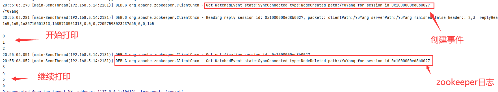
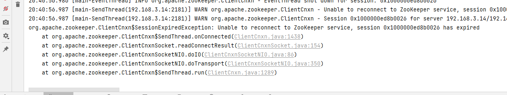
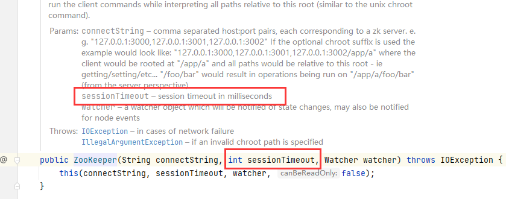

在学习zookeeper过程中，学习了一个监听节点状态变化，而开始、停止计数的案例。看懂了不代表就会了，于是想自己实现一个简单的版本。在自己实现的过程中也遇到了一些问题，在这里记录一下。


实现代码内容

- 在zookeeper中创建`/YuYang`节点开始计数

- 在zookeeper中删除`/YuYang`节点停止计数

遇到问题：

1、zookeeper收不到节点的创建与删除事件，代码如下

```java
public static void main(String[] args) throws IOException, InterruptedException, KeeperException {
    ZookeeperDemo demo = new ZookeeperDemo();
    zooKeeper = new ZooKeeper(ZK_HOST, 600, demo);
    latch.await();
}

@Override
public void process(WatchedEvent watchedEvent) {
    if (watchedEvent.getType() == Event.EventType.None) {

    } else {
        System.out.println(watchedEvent.getPath());
        if (!watchedEvent.getPath().isEmpty() && watchedEvent.getPath().equals(WATCH_PATH)) {
            zooKeeper.exists(WATCH_PATH, this, this, null);
        }
    }
}
```

通过打断点，发现`process`函数处理的事件类型都是`None`。并没有收到节点创建和删除的事件。

通过和官方示例对比，发现少了一行，在ZooKeeper创建后，先调用一次exists的方法。

```java
public static void main(String[] args) throws IOException, InterruptedException, KeeperException {
    ZookeeperDemo demo = new ZookeeperDemo();
    zooKeeper = new ZooKeeper(ZK_HOST, 60000, demo);
    zooKeeper.exists(WATCH_PATH, true, demo, null);
    latch.await();
}
```

> ToDo: 通过源码分析原因

加上之后，便能收到节点的创建事件，但是节点的删除事件始终收不到。

2、zookeeper收不到节点删除事件

在收到节点创建事件后，开启线程执行计数线程。但是收不到删除事件，导致计数无法停止，代码如下：

```java
@Override
public void processResult(int rc, String path, Object ctx, Stat stat) {
    System.out.println(stat);
    if (stat == null) {
        if (flag) {
            System.out.println("latch.countDown");
            latch.countDown();
        }
    } else {
        runnable.run();
    }
}
```

通过日志能看到，节点是删除的。但是为什么没有调用我的回调函数呢？



最后发现，我的开启新线程的方式，仅仅是`runnable.run()`，并没有新起线程，最终导致把线程卡死住了：

```java
private final Runnable runnable = () -> {
    int i = 0;
    flag = true;
    while (true) {
        System.out.println(i++);
        try {
            Thread.sleep(1000);
        } catch (InterruptedException e) {
            throw new RuntimeException(e);
        }
    }
};
```

修复，最后程序就如愿跑起来了：

```java
new Thread(runnable).start();
```

> ToDo: 从源码看看，zookeeper客户端的线程设计。

3、打断点时间太长，程序自动退出



是由于初始化参数导致：

```java
zooKeeper = new ZooKeeper(ZK_HOST, 6000, demo);
```

通过注释知道，是和zookeeper服务器保持发送心跳的超时时间，单位为毫秒。设置为6000时，即为6s，所以打断点时间过长，连接就断了。



全量代码：[https://github.com/CNYuYang/study/blob/master/zookeeper/src/main/java/run/yuyuang/zk/ZookeeperDemo.java](https://github.com/CNYuYang/study/blob/master/zookeeper/src/main/java/run/yuyuang/zk/ZookeeperDemo.java)